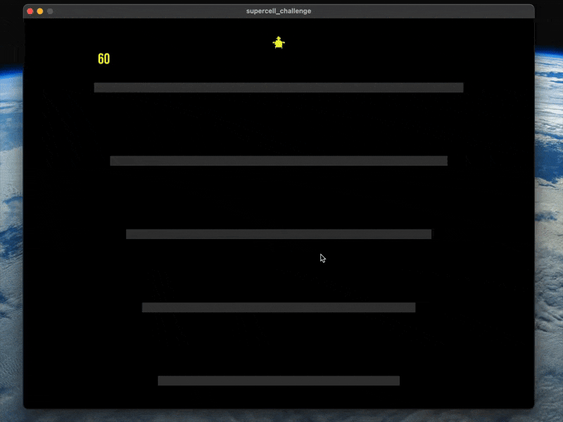
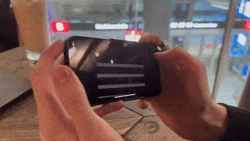

# supercell_challenge

## Survive the shivering platforms...

My submission for the **Supercell** Solo One Day Game Jam challenge! The theme given for this jam was ```survive```—here's my doing:



In the game, your goal is to survive for **60** seconds by staying on the platforms until the timer runs out. If you fall, it’s game over. Hostile **skeletons** will try to knock you off, but you’re equipped with a powerful **lance**. Not just any **lance**—it’s sharp and can be thrown at incoming enemies to fend them off!

Be careful though! Jumping or throwing your **lance** will cause the platform to shatter, so think twice!

Oh, and I made the game work on mobile as well:



And the game features some **DOPE** beats btw!


## 📖 Topics
  - Object-oriented programming
  - Game development
  - Game Jam

## 🛠️ Langs/Tools
  - C++
  - SFML
  - Box2D
  - Cmake

## 🦉 Getting started

***Note that the game has been tested on MacOS and Windows!***

You can head over to ***[Releases](https://github.com/kenlies/supercell_challenge/releases)*** to grab the zip file. Just unzip and ***run*** the executable.

**OR**

You can **build** from source:

  1. ```git clone https://github.com/kenlies/supercell_challenge```
  2. ```cd supercell_challenge```
  3. ```cmake -B build && cmake --build build``` If you don't have CMake, install it from ***[here](https://cmake.org/download/)*** or use the command line with your favourite package manager.
  4. On MacOS: ```./build/bin/survive```
  5. Survive!

## 🔨 To improve

There is some improvement to be had on code organization, because the timeframe for this project was only one day, I didn't really focus on that aspect much. I think I really achieved my vision with this one, the gameplay feels fun and the game plays quite well in my opinion. Although the movement by tilting the world is a bit questionable but ok.
